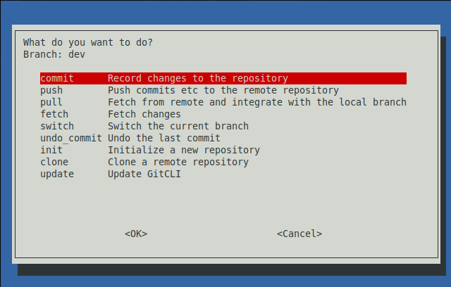

# gitcli
whiptail based terminal UI for common git actions



## installation

```bash
mkdir -p "/path/to/gitcli/" 
cd "/path/to/gitcli/"
```

```bash
wget "https://github.com/utility-libraries/gitcli/raw/main/gitcli"
```
or
```bash
curl -LO "https://github.com/utility-libraries/gitcli/raw/main/gitcli"
```

and add the following line to your `~/.bashrc`

```bash
PATH="$PATH:/path/to/gitcli/"
```
